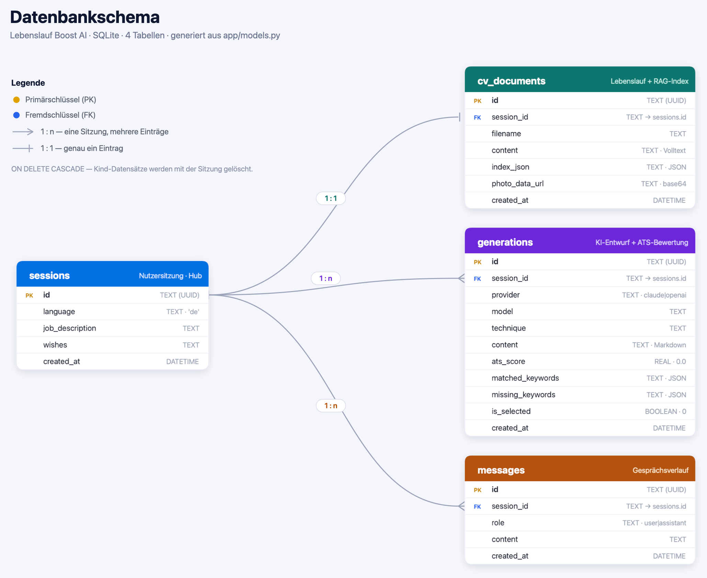

# 🚀 Lebenslauf Boost AI

KI-gestützter Lebenslauf-Optimierer. Du gibst eine **Stellenbeschreibung** und
optionale **Wünsche** ein, lädst deinen **Lebenslauf** (PDF/Word/TXT) hoch, und die
KI erstellt einen passgenauen, ATS-freundlichen Entwurf – den du **bearbeiten**,
**vergleichen** und als **PDF oder Word** in **3 Designs** herunterladen kannst.

> ⚠️ Die KI-Ausgabe ist ein **Entwurf** und muss vor Nutzung geprüft werden.

---

## ✅ Erfüllte Projekt-Anforderungen

| Anforderung | Umsetzung |
|---|---|
| **FastAPI API** | `app/main.py` – REST-Endpoints (Upload, Generate, Compare, Refine, Export) |
| **SQLite DB** | SQLAlchemy-Modelle: `sessions`, `cv_documents`, `generations`, `messages` |
| **Use-case-spezifische Vergleichsanalyse** | `/api/generate` mit `provider=compare`: Claude **und** OpenAI, ATS-Score-Vergleich + Empfehlung |
| **2 Prompt-Engineering-Techniken** | **Few-shot** + **Chain-of-Thought** (zusätzlich Role-Prompting) – `app/prompts.py` |
| **2 verschiedene Text-Generierungs-APIs** | **Anthropic Claude** + **OpenAI GPT** – `app/llm/` |
| **Conversation History** | `/api/refine` nutzt den gespeicherten Nachrichtenverlauf für iteratives Anpassen |
| **Dynamic Context Injection** | RAG injiziert die relevantesten Lebenslauf-Abschnitte + Job-Keywords in den Prompt |
| **RAG** | Upload → Chunking → OpenAI-Embeddings (mit TF-IDF-Fallback) → Retrieval – `app/rag.py` |

---

## 🛠️ Setup

```bash
cd lebenslauf-boost-ai
python3 -m venv .venv
source .venv/bin/activate
pip install -r requirements.txt

cp .env.example .env      # optional — siehe "API-Keys" unten
```

### 🔑 API-Keys — Bring your own key (BYOK)

Standardmäßig gibt **jede:r Nutzer:in den eigenen API-Key direkt in der Oberfläche ein**:
Anbieter auswählen → das passende Key-Feld erscheint (bei „Vergleich" beide) → Key eintragen.

- Der Key wird **nur im Browser** gespeichert (`localStorage`) und ausschließlich an deinen
  lokalen Server gesendet — **nie serverseitig persistiert**.
- **Leer lassen = Demo-Modus** (regelbasierte Vorschau, alles testbar ohne Key).
- Mit OpenAI-Key nutzt das RAG echte **Embeddings**, sonst automatisch **TF-IDF** (offline).

Optionaler **Server-Fallback** (z. B. lokale Einzelnutzung): trage Keys in `.env` ein, dann
müssen Nutzer:innen nichts eingeben.

```env
# Optional — nur wenn ALLE Nutzer denselben Server-Key nutzen sollen:
ANTHROPIC_API_KEY=sk-ant-...
OPENAI_API_KEY=sk-...
```

## ▶️ Starten

```bash
uvicorn app.main:app --reload
# -> http://127.0.0.1:8000
```

oder:

```bash
./run.sh
```

---

## 🔌 API-Endpoints

| Methode | Pfad | Zweck |
|---|---|---|
| `GET`  | `/` | Frontend (Single-Page-App) |
| `GET`  | `/api/status` | Anbieter- & RAG-Status |
| `POST` | `/api/session` | Neue Sitzung |
| `POST` | `/api/upload-cv` | Lebenslauf hochladen (RAG-Index) |
| `POST` | `/api/generate` | Generieren (`provider`: `claude` \| `openai` \| `compare`) |
| `POST` | `/api/refine` | Iteratives Anpassen (Conversation History) |
| `POST` | `/api/export` | Download als `pdf` \| `docx`, Design `modern`\|`classic`\|`minimal` |

Interaktive API-Doku: `http://127.0.0.1:8000/docs`

---

## 🗂️ Projektstruktur

```
lebenslauf-boost-ai/
├── app/
│   ├── main.py            # FastAPI-App & Endpoints
│   ├── config.py          # .env-Konfiguration
│   ├── database.py        # SQLite/SQLAlchemy
│   ├── models.py          # ORM-Modelle
│   ├── schemas.py         # Pydantic-Validierung
│   ├── extract.py         # PDF/DOCX/TXT-Textextraktion
│   ├── rag.py             # Chunking, Embeddings/TF-IDF, ATS-Analyse
│   ├── prompts.py         # Few-shot + Chain-of-Thought + Role
│   ├── export.py          # PDF (ReportLab) & DOCX (python-docx), 3 Designs
│   ├── llm/               # Claude- & OpenAI-Anbieter + Orchestrierung
│   └── static/            # Frontend (HTML/CSS/JS, DE/EN)
├── docs/
│   ├── schema.png         # Datenbankschema (Diagramm)
│   ├── schema.sql         # CREATE-TABLE-Anweisungen (SQLite)
│   └── schema.dbml        # Schema für dbdiagram.io
├── requirements.txt
├── .env.example
└── README.md
```

## 🗄️ Datenbank

SQLite mit vier Tabellen (SQLAlchemy-ORM). `sessions` ist die zentrale Tabelle —
alles hängt per `session_id` daran: **1:1** zu `cv_documents`, **1:n** zu
`generations` und `messages`. Beim Löschen einer Sitzung werden die Kind-Datensätze
per `ON DELETE CASCADE` mitgelöscht.



- **SQL-Schema:** [`docs/schema.sql`](docs/schema.sql)
- **dbdiagram.io:** [`docs/schema.dbml`](docs/schema.dbml) (Inhalt auf [dbdiagram.io](https://dbdiagram.io) einfügen)

## 🧭 Ablauf (UX)

1. **Eingabe** – Stellenbeschreibung + (optional) Wünsche + Lebenslauf hochladen, Anbieter wählen.
2. **Bearbeiten** – Generierten Lebenslauf editieren, ATS-Analyse sehen, per Klick/Anweisung verfeinern, bei „Vergleich" zwischen Claude/OpenAI wählen.
3. **Design & Download** – Design (Modern/Classic/Minimal) + **Foto** + Format (PDF/Word) wählen, Vorschau prüfen, herunterladen.

## 📸 Bewerbungsfoto

Beim Upload eines PDF/DOCX wird das **Bewerbungsfoto automatisch erkannt** (Heuristik:
Hochformat/quadratisch + hohe Detaildichte → echtes Foto, keine Hintergrundbilder) und in
den neuen Lebenslauf übernommen. Im letzten Schritt lässt es sich **ersetzen, hochladen oder
entfernen**. Das Foto wird je Design platziert (Modern/Minimal oben rechts, Classic zentriert)
und ist in PDF **und** Word eingebettet. Die Vorschau entspricht dem Download.
