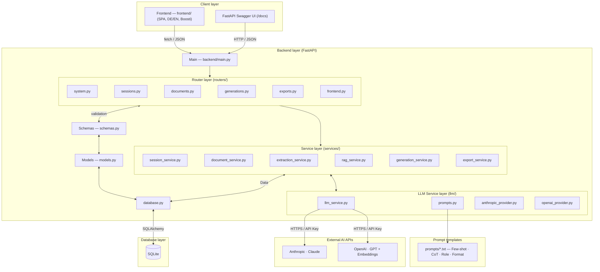
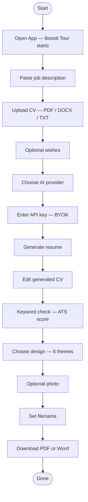
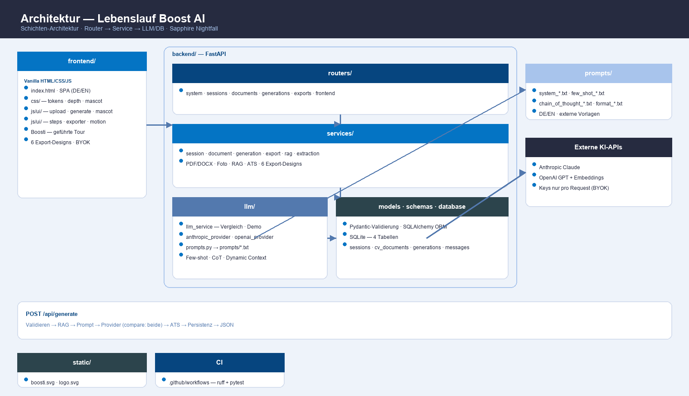
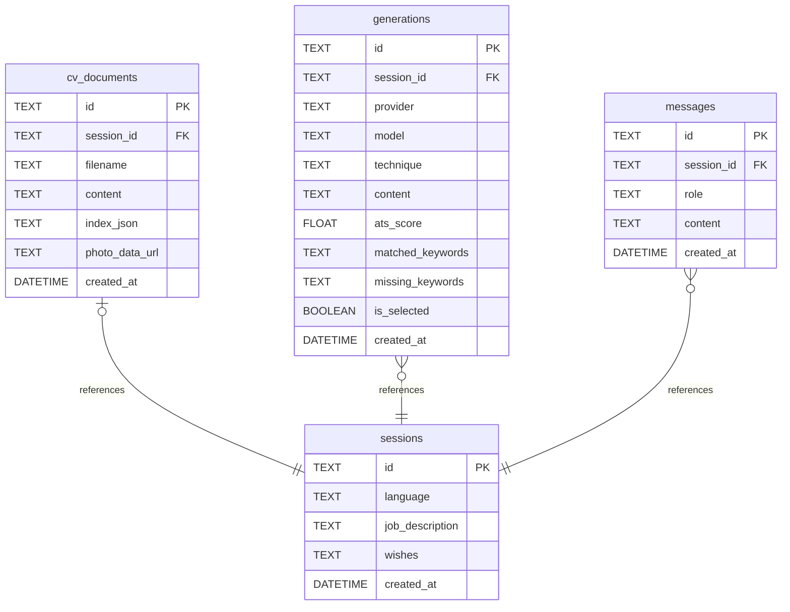

<div align="center">


# Lebenslauf Boost AI

*Dein Lebenslauf, in Sekunden auf die Stelle zugeschnitten — von zwei KIs geschrieben,
verglichen und bewertet, ohne dass eine einzige Angabe erfunden wird.*


</div>

---

Stellenanzeige einfügen, eigenen Lebenslauf hochladen (PDF/Word) — **Lebenslauf Boost AI**
liest deine echten Daten per RAG aus, lässt **Claude und OpenAI je einen Entwurf schreiben**,
bewertet beide mit einem Keyword-Check (ATS) und exportiert das Ergebnis als **PDF oder Word**
in sechs Designs, inklusive automatisch erkanntem Bewerbungsfoto. Das Maskottchen **Boosti**
führt dabei Schritt für Schritt durch die ganze App.

> ⚠️ Die KI-Ausgabe ist ein **Entwurf** und wird vor Nutzung fachlich geprüft.

---

## Was es macht

|                          |                                                                             |
|--------------------------|-----------------------------------------------------------------------------|
| **CV-Import**            | PDF, DOCX oder TXT hochladen — Text **und Bewerbungsfoto** werden extrahiert |
| **RAG**                  | CV wird gechunkt & indexiert (OpenAI-Embeddings, Fallback TF-IDF offline)   |
| **2 LLM-Anbieter**       | Anthropic Claude & OpenAI GPT — einzeln oder im direkten Vergleich          |
| **Vergleichsanalyse**    | Beide Entwürfe werden per ATS-Keyword-Score bewertet, Empfehlung inklusive  |
| **Iteratives Verfeinern**| „Kürzer", „mehr Kennzahlen" — mit gespeicherter Conversation History        |
| **Export**               | PDF (ReportLab) & Word (python-docx) in **6 Designs**, Foto positioniert    |
| **Boosti-Tour**          | Animiertes Maskottchen führt geführt durch alle Schritte (mit Erledigt-Buttons) |
| **BYOK**                 | Jede:r Nutzer:in bringt den eigenen API-Key mit — bleibt nur im Browser     |
| **Demo-Modus**           | Ohne Key voll durchspielbar (regelbasierte, klar markierte Vorschau)        |

---

## Screenshots

| 1 · Eingabe & Upload | 2 · Bearbeiten & Keyword-Check | 3 · Design & Download |
|---|---|---|
|  |  |  |

---

## Projektvideo

Die vollständige deutschsprachige Projektvorstellung zeigt den Ablauf von
CV-Upload und RAG über den KI-Vergleich bis zum PDF-/Word-Export:

- [Projektvideo öffnen (MP4, ca. 4:48 Minuten)](docs/video/lebenslauf-boost-ai-projektvideo.mp4)
- [Deutsche Untertitel](docs/video/lebenslauf-boost-ai-projektvideo.srt)
- [Sprechertext und Kapitel](docs/video/README.md)

---

## Projektpräsentation

- [PowerPoint-Präsentation (5 Folien)](docs/presentation/lebenslauf-boost-ai-praesentation.pptx)
- [PDF-Präsentation (5 Seiten)](docs/presentation/lebenslauf-boost-ai-praesentation.pdf)
- [Sprechertext (ca. 4 Minuten)](docs/presentation/sprechertext.md)

---

## Endpoints

### System

| Method    | Endpoint      | Beschreibung                          |
|-----------|---------------|---------------------------------------|
| **`GET`** | `/`           | Frontend (Single-Page-App)            |
| **`GET`** | `/api/status` | Anbieter-Status & RAG-Modus           |

### Sitzung & Lebenslauf

| Method     | Endpoint         | Beschreibung                                            |
|------------|------------------|----------------------------------------------------------|
| **`POST`** | `/api/session`   | Neue Sitzung anlegen (`?language=de\|en`)                |
| **`POST`** | `/api/upload-cv` | CV hochladen → Text- & Foto-Extraktion, RAG-Index        |

### Generierung

| Method     | Endpoint        | Beschreibung                                                       |
|------------|-----------------|---------------------------------------------------------------------|
| **`POST`** | `/api/generate` | Entwurf erzeugen — `provider: claude \| openai \| compare`          |
| **`POST`** | `/api/refine`   | Iterativ anpassen (nutzt Conversation History aus der DB)          |

### Export

| Method     | Endpoint      | Beschreibung                                                        |
|------------|---------------|----------------------------------------------------------------------|
| **`POST`** | `/api/export` | Download als `pdf` \| `docx` — Design `modern \| classic \| minimal \| sapphire \| cobalt \| slate` |

Interaktive API-Doku (Swagger): `http://127.0.0.1:8000/docs`

---

## Tech-Stack

| Komponente     | Technologie                                        |
|----------------|-----------------------------------------------------|
| Backend        | FastAPI + Uvicorn                                   |
| Datenbank      | SQLite (SQLAlchemy ORM)                             |
| Validierung    | Pydantic v2                                         |
| LLM 1          | Anthropic Claude (claude-sonnet)                    |
| LLM 2          | OpenAI (gpt-4o-mini) + Embeddings (text-embedding-3)|
| RAG-Fallback   | Eigenes TF-IDF (pure Python, offline)               |
| Datei-Parsing  | pypdf · python-docx · Pillow (Foto-Erkennung)       |
| Export         | ReportLab (PDF) · python-docx (Word)                |
| Frontend       | Vanilla HTML/CSS/JS (ES-Module) · DE/EN · „Sapphire Nightfall" mit 3D-Effekten & Boosti-Maskottchen |
| CI             | GitHub Actions (ruff + pytest)                      |

---

## Frontend-Erlebnis

- **Sapphire-Nightfall-Design:** Blaue Farbpalette von hell-luftig bis tief-dunkel,
  vollbreiter Hero, dezente 3D-Karten und Glas-Effekte.
- **Boosti, der Bewerbungs-Coach:** Ein animiertes Maskottchen begleitet durch alle
  drei Seiten — es fliegt zum jeweils aktuellen Schritt (immer am Seitenrand, nie im Weg),
  erklärt in einer Sprechblase, was zu tun ist, und geht per **„Erledigt ✓"-Button**
  zum nächsten Punkt. Die Tour deckt alle Stationen ab: Stellenanzeige → CV-Upload →
  Wünsche → KI-Anbieter → API-Key → Generieren → Bearbeiten → Keyword-Check →
  Design → Foto → Dateiname → Download (mit Konfetti-Finale).
- **Ruhige Bewegung:** Sanftes Auto-Scrollen zur jeweiligen Station, Fluganimation beim
  Seitenwechsel, `prefers-reduced-motion` wird durchgängig respektiert.

---

## Erfüllte Kurs-Anforderungen

| Anforderung                          | Umsetzung                                                          |
|--------------------------------------|---------------------------------------------------------------------|
| FastAPI API                          | `backend/routers/` — 7 REST-Endpoints (dünne Router-Schicht)       |
| SQLite DB                            | 4 Tabellen via SQLAlchemy (`backend/models.py`)                    |
| Use-case-spezifische Vergleichsanalyse | `provider=compare`: Claude vs. OpenAI + ATS-Score + Empfehlung   |
| 2 Prompt-Engineering-Techniken       | **Few-shot** + **Chain-of-Thought** (+ Role-Prompting), Vorlagen in `prompts/` |
| 2 Text-Generierungs-APIs             | Anthropic & OpenAI, getrennt gekapselt (`backend/llm/`)            |
| Conversation History                 | `/api/refine` nutzt den gespeicherten Nachrichtenverlauf           |
| Dynamic Context Injection            | RAG-Auszüge + Stellenanzeige + Wünsche werden zur Laufzeit injiziert |
| RAG (optional)                       | Chunking → Embeddings/TF-IDF → Retrieval (`backend/services/rag_service.py`) |

---

## Getting Started

### Voraussetzungen

Python **3.11+** (getestet mit 3.13).

### Installation

```bash
git clone https://github.com/Kastriottafolli/Lebenslauf-Boost-AI.git
cd Lebenslauf-Boost-AI

python3 -m venv .venv
source .venv/bin/activate
pip install -r requirements.txt
```

### Starten

```bash
python run.py
# → http://localhost:8000
```

Alternativ: `./run.sh` — oder in **PyCharm** einfach `run.py` öffnen und ▶ drücken.

### API-Keys (Bring your own key)

Keine Server-Konfiguration nötig: **Der API-Key wird direkt in der Oberfläche eingegeben**
(Anbieter wählen → Key-Feld erscheint). Er bleibt im Browser (`localStorage`) und wird
nie serverseitig gespeichert. **Ohne Key läuft die App im Demo-Modus.**

Optionaler Server-Fallback über `.env` (siehe [`.env.example`](.env.example)):

```env
ANTHROPIC_API_KEY=sk-ant-...
OPENAI_API_KEY=sk-...
```

---

## Aktualisieren (GitHub)

Ein Befehl committet & pusht alle Änderungen:

```bash
./update.sh "Beschreibung der Änderung"
```

---

## Architecture

### Backend



Source: [`diagrams/architecture.mmd`](diagrams/architecture.mmd)

**Request flow `POST /api/generate`:**
Pydantic validation → RAG retrieves relevant CV chunks → prompt build (role + few-shot + CoT + injected context) → provider call (both if `compare`) → ATS analysis → persist (generation + message) → JSON response.

<details>
<summary>User flow (Boosti tour)</summary>



Source: [`diagrams/user_flowchart.mmd`](diagrams/user_flowchart.mmd)

</details>

<details>
<summary>Beginner infographic (PNG)</summary>



</details>

---

## Database

### Diagram



Source: [`diagrams/database.mmd`](diagrams/database.mmd)

`sessions` is the central hub — **1 : 0..1** to `cv_documents` (enforced by **UNIQUE** FK),
**1 : n** to `generations` and `messages`. All foreign keys are `NOT NULL` + indexed,
value ranges (`language`, `provider`, `technique`, `role`, `ats_score`) secured by **CHECK**
constraints, deletes cascade. IDs are UUIDv4.

<details>
<summary>Beginner infographic (PNG)</summary>


</details>

| Dokument | Inhalt |
|---|---|
| [`diagrams/database.mmd`](diagrams/database.mmd) | Mermaid ER-Diagramm (GitHub-rendered) |
| 📘 [`docs/DATABASE.md`](docs/DATABASE.md) | **Ausführliche Doku**: Spalten-Wörterbücher, JSON-Strukturen, Datenfluss je Endpoint |
| [`docs/schema.svg`](docs/schema.svg) | Erweiterte SVG-Infografik (skalierbar, gleicher Inhalt wie PNG) |
| [`docs/schema-extended.svg`](docs/schema-extended.svg) | Vollversion inkl. Roadmap-Tabellen |
| [`docs/schema.sql`](docs/schema.sql) | Validierte DDL (CREATE TABLE + CHECKs + Indizes) |
| [`docs/schema.dbml`](docs/schema.dbml) | Für [dbdiagram.io](https://dbdiagram.io) (mit Enums & Notes) |

---

## Prompt Engineering

| Technik                  | Umsetzung                                                                 |
|--------------------------|----------------------------------------------------------------------------|
| **Few-shot**             | Vorher/Nachher-Beispiele für starke, kennzahlbasierte Formulierungen      |
| **Chain-of-Thought**     | Modell analysiert erst Stelle → mappt Erfahrung → schreibt dann           |
| **Role-Prompting**       | System-Persona: Karriere-Coach mit 15+ Jahren ATS-Erfahrung               |
| **Dynamic Context Injection** | Stellenanzeige + Wünsche + RAG-Auszüge zur Laufzeit im Prompt        |

In der UI wählbar unter *Erweitert: Prompt-Technik* (`auto` kombiniert Few-shot + CoT).

---

## Projektstruktur

```
lebenslauf-boost-ai/
├── .github/
│   └── workflows/
│       └── ci.yml                   # CI: Lint (ruff) + Tests (pytest)
├── backend/                         # ── FastAPI-Backend (Schichten-Architektur) ──
│   ├── main.py                      # App-Fabrik: Router registrieren, Frontend mounten
│   ├── config.py                    # .env-Konfiguration (pydantic-settings)
│   ├── database.py                  # SQLite/SQLAlchemy Engine & Session
│   ├── models.py                    # ORM: sessions, cv_documents, generations, messages
│   ├── schemas.py                   # Pydantic Request/Response-Schemas
│   ├── routers/                     # HTTP-Endpunkte (dünn, delegieren an Services)
│   │   ├── system.py                #   GET  /api/status
│   │   ├── sessions.py              #   POST /api/session
│   │   ├── documents.py             #   POST /api/upload-cv
│   │   ├── generations.py           #   POST /api/generate · /api/refine
│   │   ├── exports.py               #   POST /api/export
│   │   └── frontend.py              #   GET  /
│   ├── services/                    # Geschäftslogik
│   │   ├── session_service.py       #   Sitzungen anlegen/laden
│   │   ├── document_service.py      #   Upload: Text/Foto + RAG-Index
│   │   ├── extraction_service.py    #   PDF/DOCX/TXT-Text + Foto-Erkennung (Pillow)
│   │   ├── rag_service.py           #   Chunking · Embeddings/TF-IDF · Keyword-Check
│   │   ├── generation_service.py    #   Generieren · Vergleichen · Verfeinern
│   │   └── export_service.py        #   PDF (ReportLab) & DOCX (python-docx), 6 Designs
│   ├── llm/                         # KI-Anbieter-Schicht
│   │   ├── base.py                  #   Abstrakte Provider-Schnittstelle
│   │   ├── anthropic_provider.py    #   Claude
│   │   ├── openai_provider.py       #   GPT + Embeddings für RAG
│   │   ├── llm_service.py           #   Orchestrierung · Vergleich · Demo-Fallback
│   │   └── prompts.py               #   Lädt Vorlagen aus prompts/ (mit Cache)
│   └── tests/
│       └── test_api.py              # API-Tests (offline, Demo-Modus)
├── frontend/                        # ── Single-Page-App (Vanilla JS, ES-Module) ──
│   ├── index.html
│   ├── css/                         # tokens · base · layout · components · depth (3D) · mascot · animations
│   └── js/                          # api · state · i18n · ui/ (upload, generate, mascot, motion, …)
├── prompts/                         # ── Prompt-Vorlagen als Textdateien (DE/EN) ──
│   ├── system_*.txt                 # Role Prompting
│   ├── few_shot_*.txt               # Few-shot-Beispiele
│   ├── chain_of_thought_*.txt       # CoT-Anleitung
│   ├── format_*.txt                 # Verbindliches Ausgabeformat
│   └── user_message_*.txt           # Haupt-Prompt mit Platzhaltern
├── src/
│   └── types/
│       └── api.d.ts                 # Geteilte API-Typen (Frontend/Backend-Vertrag)
├── static/                          # Statische Assets (Boosti-Maskottchen, Logo)
├── diagrams/                        # Mermaid source files (architecture, database, user flow)
│   ├── architecture.mmd
│   ├── database.mmd
│   └── user_flowchart.mmd
├── docs/                            # Schema docs, screenshots, PNG infographics, presentation
│   ├── DATABASE.md · schema.sql · schema.dbml
│   ├── architecture.png · schema.png
│   └── make_diagrams.py
├── requirements.txt
├── run.py / run.sh                  # Start-Skripte
├── update.sh                        # Ein-Befehl-Update zu GitHub
└── .env.example
```

---

## Roadmap

### Fertig

- [x] FastAPI-Backend + SQLite (SQLAlchemy, 4 Tabellen)
- [x] CV-Upload: Text-Extraktion aus PDF/DOCX/TXT
- [x] Automatische **Bewerbungsfoto-Erkennung** (Heuristik: Format + Detaildichte)
- [x] RAG: Chunking, OpenAI-Embeddings, TF-IDF-Fallback (offline)
- [x] 2 LLM-Anbieter (Claude & OpenAI), Strategy-Pattern
- [x] Vergleichsmodus mit ATS-Keyword-Score & Empfehlung
- [x] Prompt Engineering: Few-shot + Chain-of-Thought + Rolle
- [x] Iteratives Verfeinern mit Conversation History
- [x] Export: PDF & Word in **6 Designs** (Azure, Executive, Nordic, Sapphire, Cobalt, Slate), Foto je Design positioniert
- [x] Bring-your-own-key (Keys nur im Browser) + Demo-Modus
- [x] Zweisprachige UI (DE/EN), „Sapphire Nightfall"-Design mit 3D-Effekten
- [x] **Boosti-Maskottchen** mit geführter Tour (Erledigt-Buttons, Fluganimation, sanftes Scrollen)
- [x] Gewichtete Keyword-Extraktion (Nomen/Fachbegriffe statt Füllwörter)
- [x] Architecture diagrams (Mermaid) — [`diagrams/`](diagrams/)
- [x] Code-Refactoring: Schichten-Architektur (routers/ · services/ · llm/ · prompts/)
- [x] Tests (pytest) + CI (GitHub Actions: ruff + pytest)

### Geplant

- [ ] Beispiel-Modus (Muster-CV + Muster-Stelle mit einem Klick)
- [ ] Formatierte Live-Vorschau im Editor (statt Roh-Markdown)
- [ ] Anschreiben-Generator
- [ ] Versions-Verlauf mit Zurückspringen
- [ ] Docker-Image
- [ ] Login & Nutzerkonten

---

## Sicherheit & Datenschutz

- API-Keys werden **pro Anfrage** übertragen und **nie serverseitig gespeichert** (BYOK).
- `.env`, Datenbank und Uploads sind via `.gitignore` vom Repo ausgeschlossen.
- Die KI wird explizit angewiesen, **keine Fakten zu erfinden** — Grundlage sind
  ausschließlich die per RAG ausgelesenen echten CV-Inhalte.
