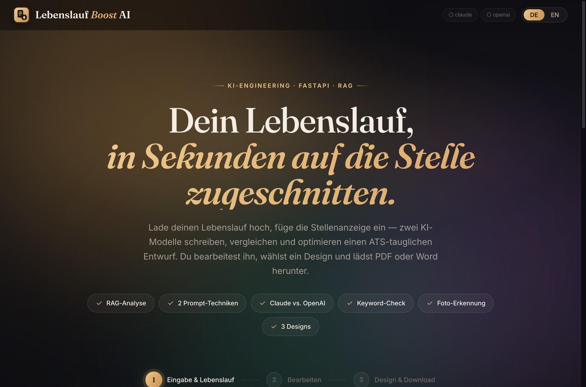
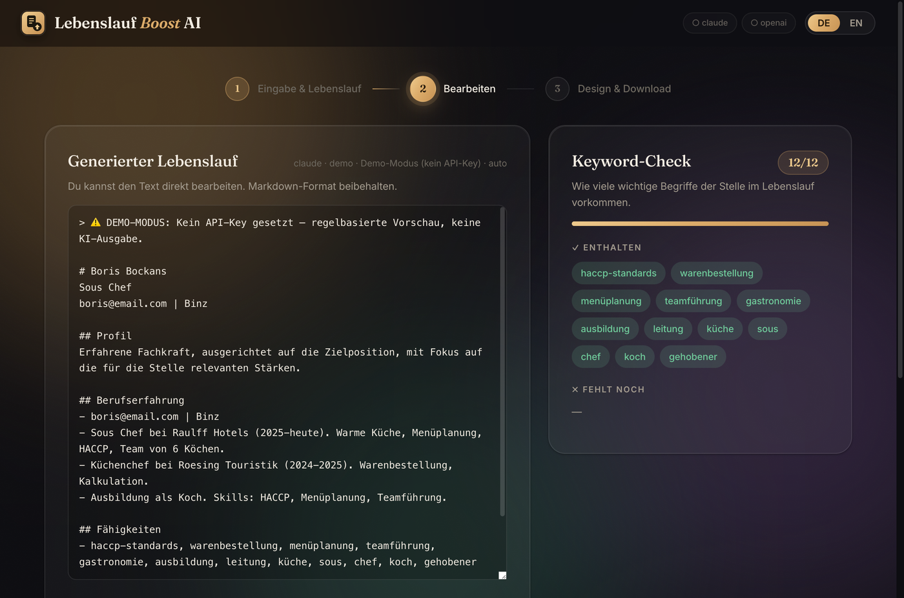
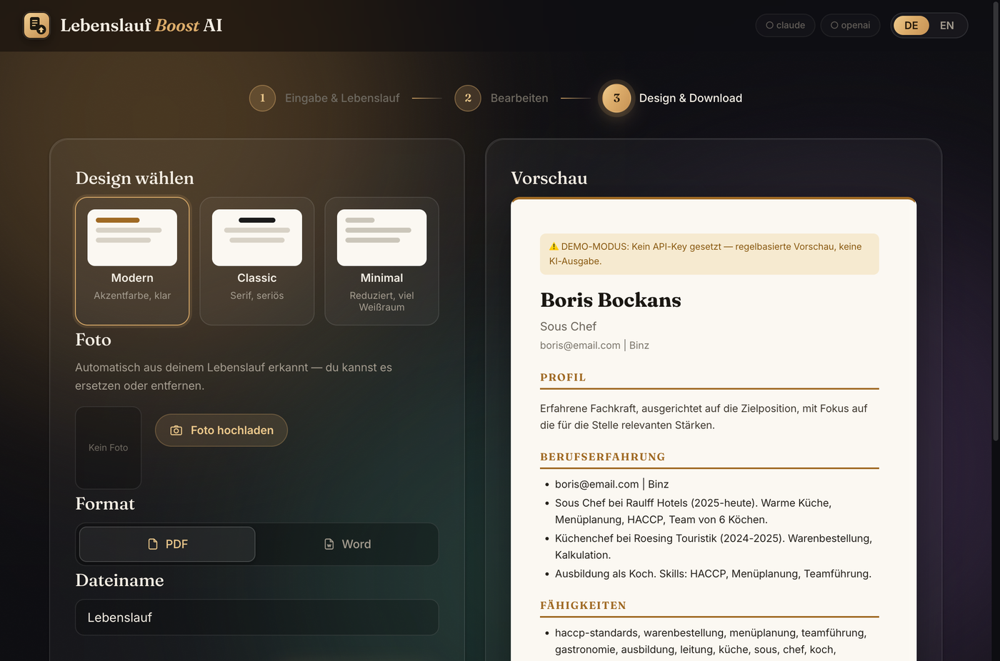
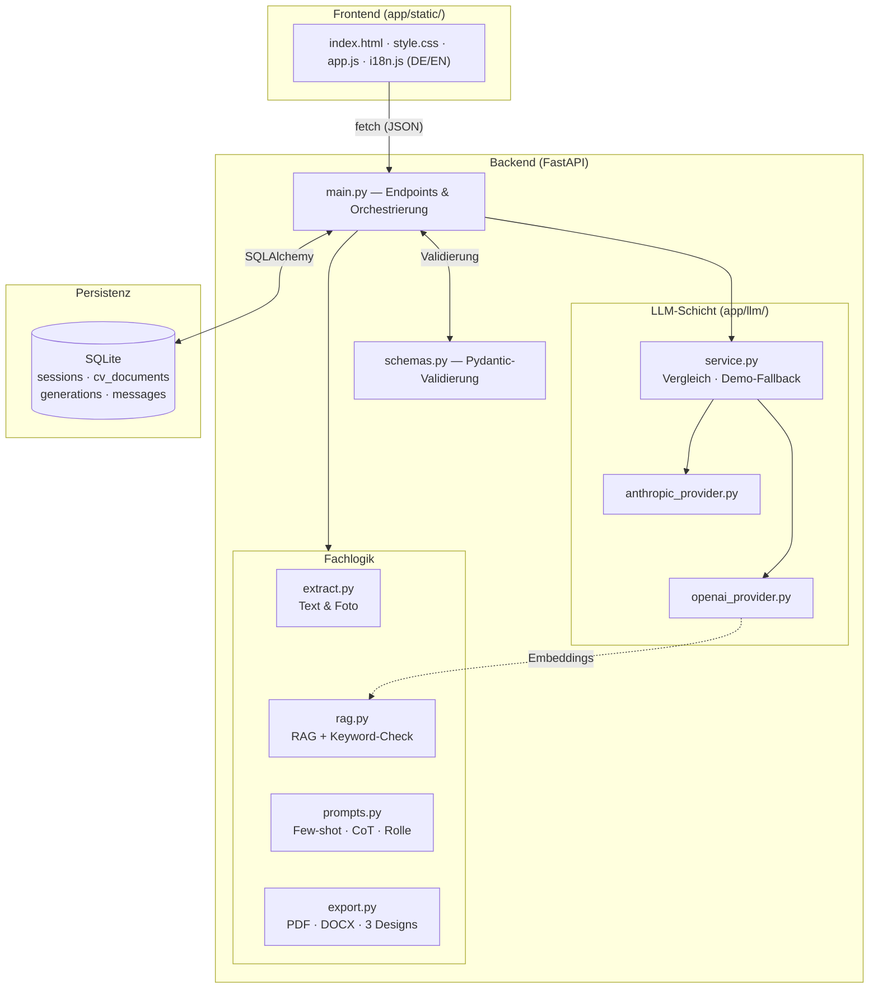

<div align="center">


# Lebenslauf Boost AI

*Dein Lebenslauf, in Sekunden auf die Stelle zugeschnitten — von zwei KIs geschrieben,
verglichen und bewertet, ohne dass eine einzige Angabe erfunden wird.*


</div>

---

Stellenanzeige einfügen, eigenen Lebenslauf hochladen (PDF/Word) — **Lebenslauf Boost AI**
liest deine echten Daten per RAG aus, lässt **Claude und OpenAI je einen Entwurf schreiben**,
bewertet beide mit einem Keyword-Check (ATS) und exportiert das Ergebnis als **PDF oder Word**
in drei Designs, inklusive automatisch erkanntem Bewerbungsfoto.

> ⚠️ Die KI-Ausgabe ist ein **Entwurf** und wird vor Nutzung fachlich geprüft.

---

## Was es macht

|                          |                                                                             |
|--------------------------|-----------------------------------------------------------------------------|
| **CV-Import**            | PDF, DOCX oder TXT hochladen — Text **und Bewerbungsfoto** werden extrahiert |
| **RAG**                  | CV wird gechunkt & indexiert (OpenAI-Embeddings, Fallback TF-IDF offline)   |
| **2 LLM-Anbieter**       | Anthropic Claude & OpenAI GPT — einzeln oder im direkten Vergleich          |
| **Vergleichsanalyse**    | Beide Entwürfe werden per ATS-Keyword-Score bewertet, Empfehlung inklusive  |
| **Iteratives Verfeinern**| „Kürzer", „mehr Kennzahlen" — mit gespeicherter Conversation History        |
| **Export**               | PDF (ReportLab) & Word (python-docx) in 3 Designs, Foto positioniert        |
| **BYOK**                 | Jede:r Nutzer:in bringt den eigenen API-Key mit — bleibt nur im Browser     |
| **Demo-Modus**           | Ohne Key voll durchspielbar (regelbasierte, klar markierte Vorschau)        |

---

## Screenshots

| 1 · Eingabe & Upload | 2 · Bearbeiten & Keyword-Check | 3 · Design & Download |
|---|---|---|
|  |  |  |

---

## Endpoints

### System

| Method    | Endpoint      | Beschreibung                          |
|-----------|---------------|---------------------------------------|
| **`GET`** | `/`           | Frontend (Single-Page-App)            |
| **`GET`** | `/api/status` | Anbieter-Status & RAG-Modus           |

### Sitzung & Lebenslauf

| Method     | Endpoint         | Beschreibung                                            |
|------------|------------------|----------------------------------------------------------|
| **`POST`** | `/api/session`   | Neue Sitzung anlegen (`?language=de\|en`)                |
| **`POST`** | `/api/upload-cv` | CV hochladen → Text- & Foto-Extraktion, RAG-Index        |

### Generierung

| Method     | Endpoint        | Beschreibung                                                       |
|------------|-----------------|---------------------------------------------------------------------|
| **`POST`** | `/api/generate` | Entwurf erzeugen — `provider: claude \| openai \| compare`          |
| **`POST`** | `/api/refine`   | Iterativ anpassen (nutzt Conversation History aus der DB)          |

### Export

| Method     | Endpoint      | Beschreibung                                                        |
|------------|---------------|----------------------------------------------------------------------|
| **`POST`** | `/api/export` | Download als `pdf` \| `docx` — Design `modern \| classic \| minimal` |

Interaktive API-Doku (Swagger): `http://127.0.0.1:8000/docs`

---

## Tech-Stack

| Komponente     | Technologie                                        |
|----------------|-----------------------------------------------------|
| Backend        | FastAPI + Uvicorn                                   |
| Datenbank      | SQLite (SQLAlchemy ORM)                             |
| Validierung    | Pydantic v2                                         |
| LLM 1          | Anthropic Claude (claude-sonnet)                    |
| LLM 2          | OpenAI (gpt-4o-mini) + Embeddings (text-embedding-3)|
| RAG-Fallback   | Eigenes TF-IDF (pure Python, offline)               |
| Datei-Parsing  | pypdf · python-docx · Pillow (Foto-Erkennung)       |
| Export         | ReportLab (PDF) · python-docx (Word)                |
| Frontend       | Vanilla HTML/CSS/JS · DE/EN · „Editorial Dark Luxe" |

---

## Erfüllte Kurs-Anforderungen

| Anforderung                          | Umsetzung                                                          |
|--------------------------------------|---------------------------------------------------------------------|
| FastAPI API                          | `app/main.py` — 7 REST-Endpoints                                   |
| SQLite DB                            | 4 Tabellen via SQLAlchemy (`app/models.py`)                        |
| Use-case-spezifische Vergleichsanalyse | `provider=compare`: Claude vs. OpenAI + ATS-Score + Empfehlung   |
| 2 Prompt-Engineering-Techniken       | **Few-shot** + **Chain-of-Thought** (+ Role-Prompting), `prompts.py` |
| 2 Text-Generierungs-APIs             | Anthropic & OpenAI, getrennt gekapselt (`app/llm/`)                |
| Conversation History                 | `/api/refine` nutzt den gespeicherten Nachrichtenverlauf           |
| Dynamic Context Injection            | RAG-Auszüge + Stellenanzeige + Wünsche werden zur Laufzeit injiziert |
| RAG (optional)                       | Chunking → Embeddings/TF-IDF → Retrieval (`app/rag.py`)            |

---

## Getting Started

### Voraussetzungen

Python **3.11+** (getestet mit 3.13).

### Installation

```bash
git clone https://github.com/Kastriottafolli/Lebenslauf-Boost-AI.git
cd Lebenslauf-Boost-AI

python3 -m venv .venv
source .venv/bin/activate
pip install -r requirements.txt
```

### Starten

```bash
python run.py
# → http://localhost:8000
```

Alternativ: `./run.sh` — oder in **PyCharm** einfach `run.py` öffnen und ▶ drücken.

### API-Keys (Bring your own key)

Keine Server-Konfiguration nötig: **Der API-Key wird direkt in der Oberfläche eingegeben**
(Anbieter wählen → Key-Feld erscheint). Er bleibt im Browser (`localStorage`) und wird
nie serverseitig gespeichert. **Ohne Key läuft die App im Demo-Modus.**

Optionaler Server-Fallback über `.env` (siehe [`.env.example`](.env.example)):

```env
ANTHROPIC_API_KEY=sk-ant-...
OPENAI_API_KEY=sk-...
```

---

## Aktualisieren (GitHub)

Ein Befehl committet & pusht alle Änderungen:

```bash
./update.sh "Beschreibung der Änderung"
```

---

## Architektur



**Request-Ablauf `POST /api/generate`:**
Pydantic-Validierung → RAG holt relevante CV-Chunks → Prompt-Bau (Rolle + Few-shot + CoT +
injizierter Kontext) → Provider-Aufruf (bei `compare` beide) → ATS-Analyse → Persistenz
(Generation + Message) → JSON-Response.

---

## Datenbankschema

`sessions` ist die zentrale Tabelle — **1:1** zu `cv_documents`, **1:n** zu `generations`
und `messages`, verbunden per Fremdschlüssel mit `ON DELETE CASCADE`. IDs sind UUIDs.


- SQL: [`docs/schema.sql`](docs/schema.sql) · DBML für [dbdiagram.io](https://dbdiagram.io): [`docs/schema.dbml`](docs/schema.dbml)

---

## Prompt Engineering

| Technik                  | Umsetzung                                                                 |
|--------------------------|----------------------------------------------------------------------------|
| **Few-shot**             | Vorher/Nachher-Beispiele für starke, kennzahlbasierte Formulierungen      |
| **Chain-of-Thought**     | Modell analysiert erst Stelle → mappt Erfahrung → schreibt dann           |
| **Role-Prompting**       | System-Persona: Karriere-Coach mit 15+ Jahren ATS-Erfahrung               |
| **Dynamic Context Injection** | Stellenanzeige + Wünsche + RAG-Auszüge zur Laufzeit im Prompt        |

In der UI wählbar unter *Erweitert: Prompt-Technik* (`auto` kombiniert Few-shot + CoT).

---

## Projektstruktur

```
lebenslauf-boost-ai/
├── app/
│   ├── main.py                  # FastAPI-App & Endpoints
│   ├── config.py                # .env-Konfiguration (pydantic-settings)
│   ├── database.py              # SQLite/SQLAlchemy Engine & Session
│   ├── models.py                # ORM: sessions, cv_documents, generations, messages
│   ├── schemas.py               # Pydantic Request/Response-Schemas
│   ├── extract.py               # PDF/DOCX/TXT-Text + Foto-Erkennung (Pillow)
│   ├── rag.py                   # Chunking · Embeddings/TF-IDF · Keyword-Check
│   ├── prompts.py               # Few-shot · Chain-of-Thought · Role
│   ├── export.py                # PDF (ReportLab) & DOCX (python-docx), 3 Designs
│   ├── llm/
│   │   ├── base.py              # Abstrakte Provider-Schnittstelle
│   │   ├── anthropic_provider.py
│   │   ├── openai_provider.py   # + Embeddings für RAG
│   │   └── service.py           # Orchestrierung · Vergleich · Demo-Fallback
│   └── static/                  # Frontend (HTML/CSS/JS, DE/EN)
├── docs/
│   ├── schema.png|svg|sql|dbml  # Datenbankschema
│   └── screenshots/             # App-Screenshots
├── requirements.txt
├── run.py / run.sh              # Start-Skripte
├── update.sh                    # Ein-Befehl-Update zu GitHub
└── .env.example
```

---

## Roadmap

### Fertig

- [x] FastAPI-Backend + SQLite (SQLAlchemy, 4 Tabellen)
- [x] CV-Upload: Text-Extraktion aus PDF/DOCX/TXT
- [x] Automatische **Bewerbungsfoto-Erkennung** (Heuristik: Format + Detaildichte)
- [x] RAG: Chunking, OpenAI-Embeddings, TF-IDF-Fallback (offline)
- [x] 2 LLM-Anbieter (Claude & OpenAI), Strategy-Pattern
- [x] Vergleichsmodus mit ATS-Keyword-Score & Empfehlung
- [x] Prompt Engineering: Few-shot + Chain-of-Thought + Rolle
- [x] Iteratives Verfeinern mit Conversation History
- [x] Export: PDF & Word in 3 Designs, Foto je Design positioniert
- [x] Bring-your-own-key (Keys nur im Browser) + Demo-Modus
- [x] Zweisprachige UI (DE/EN), „Editorial Dark Luxe"-Design mit Animationen
- [x] Gewichtete Keyword-Extraktion (Nomen/Fachbegriffe statt Füllwörter)
- [x] Datenbankschema-Doku (PNG/SQL/DBML) & Architektur-Diagramm

### Geplant

- [ ] Beispiel-Modus (Muster-CV + Muster-Stelle mit einem Klick)
- [ ] Formatierte Live-Vorschau im Editor (statt Roh-Markdown)
- [ ] Anschreiben-Generator
- [ ] Versions-Verlauf mit Zurückspringen
- [ ] Tests (pytest) & Docker-Image
- [ ] Login & Nutzerkonten

---

## Sicherheit & Datenschutz

- API-Keys werden **pro Anfrage** übertragen und **nie serverseitig gespeichert** (BYOK).
- `.env`, Datenbank und Uploads sind via `.gitignore` vom Repo ausgeschlossen.
- Die KI wird explizit angewiesen, **keine Fakten zu erfinden** — Grundlage sind
  ausschließlich die per RAG ausgelesenen echten CV-Inhalte.
