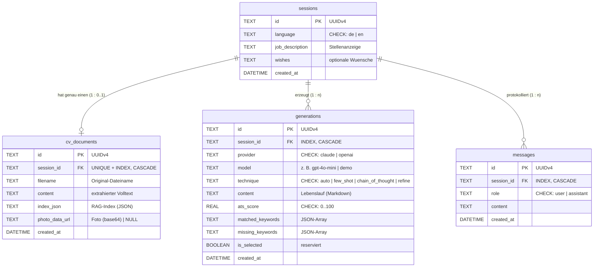

# Datenbank-Dokumentation

**Lebenslauf Boost AI** · SQLite (MVP) / PostgreSQL (Roadmap) · SQLAlchemy ORM · 4–9 Tabellen
Quelle der Wahrheit: [`backend/models.py`](../backend/models.py) · DDL: [`schema.sql`](schema.sql) · DBML: [`schema.dbml`](schema.dbml)

**Empfohlener Einstieg für Anfänger:innen:**
1. [`schema-extended.svg`](schema-extended.svg) öffnen: Die Infografik erklärt den kompletten App-Ablauf in acht nummerierten Schritten.
2. Das [interaktive Datenbank-Canvas](/Users/kastriottafolli/.cursor/projects/Users-kastriottafolli-claude-code-tafolli-lebenslauf-boost-ai/canvases/datenbank-schema.canvas.tsx) öffnen: Dort können Ablauf, Beziehungen, alle Felder und die Roadmap getrennt betrachtet werden.
3. Erst danach diese technische Dokumentation und die DDL lesen.

**Alle Schema-Artefakte:**
- Anfänger-Infografik mit MVP + Roadmap: [`schema-extended.svg`](schema-extended.svg)
- Interaktive Schritt-für-Schritt-Erklärung: [`datenbank-schema.canvas.tsx`](/Users/kastriottafolli/.cursor/projects/Users-kastriottafolli-claude-code-tafolli-lebenslauf-boost-ai/canvases/datenbank-schema.canvas.tsx)
- Kompaktes MVP-Diagramm: [`schema.svg`](schema.svg)
- Aktuelles SQLite-DDL: [`schema.sql`](schema.sql)
- Aktuelles SQLite-DBML: [`schema.dbml`](schema.dbml)
- Geplantes PostgreSQL-DDL: [`schema-extended.sql`](schema-extended.sql)
- Geplantes PostgreSQL-DBML: [`schema-extended.dbml`](schema-extended.dbml)

> **Wichtige Trennung:** Die vier Tabellen `sessions`, `cv_documents`,
> `generations` und `messages` sind im MVP implementiert. `users`, `api_keys`,
> `subscriptions`, `cover_letters` und `export_templates` sind ein
> Ausbauvorschlag und noch nicht Bestandteil von `backend/models.py`.

---

## 1 · Überblick

Die Datenbank ist um eine zentrale Entität herum entworfen: die **Sitzung** (`sessions`).
Eine Sitzung entsteht beim Öffnen der App und klammert alles, was ein:e Nutzer:in erzeugt:
den hochgeladenen Lebenslauf (**genau einer**, 1:1), alle KI-Generierungen (**beliebig
viele**, 1:n) und den Konversationsverlauf für iteratives Verfeinern (1:n).



Grafische Übersicht: 

---

## 2 · Tabellen im Detail

### 2.1 `sessions` — der Hub

Eine Zeile pro Nutzersitzung (Frontend legt sie beim Laden per `POST /api/session` an).

| Spalte | Typ | Null | Default | Constraint | Bedeutung / Beispiel |
|---|---|---|---|---|---|
| `id` | `VARCHAR(36)` | ✗ | `uuid4()` | **PK** | `"a3f1…-…"` — UUIDv4, nicht erratbar |
| `language` | `VARCHAR(2)` | ✗ | `'de'` | `CHECK IN ('de','en')` | UI-/Ausgabesprache |
| `job_description` | `TEXT` | ✗ | `''` | — | Eingefügte Stellenanzeige (wird bei `/api/generate` aktualisiert) |
| `wishes` | `TEXT` | ✗ | `''` | — | Optionale Wünsche, z. B. *„kompakt, Fokus Leadership"* |
| `created_at` | `DATETIME` | ✗ | `utcnow()` | — | Erstellzeitpunkt (UTC) |

### 2.2 `cv_documents` — Lebenslauf + RAG-Index (1:1)

Genau **ein** Dokument pro Sitzung. Erzwingt die Datenbank selbst:
`session_id` ist **UNIQUE**. Ein erneuter Upload ersetzt den Datensatz
(`/api/upload-cv` löscht die alte Zeile und legt eine neue an).

| Spalte | Typ | Null | Default | Constraint | Bedeutung / Beispiel |
|---|---|---|---|---|---|
| `id` | `VARCHAR(36)` | ✗ | `uuid4()` | **PK** | — |
| `session_id` | `VARCHAR(36)` | ✗ | — | **FK** → `sessions.id`, **UNIQUE**, **INDEX**, `ON DELETE CASCADE` | 1:1-Anker |
| `filename` | `VARCHAR(255)` | ✗ | — | — | `"boriss 2026 lebenslauf.pdf"` |
| `content` | `TEXT` | ✗ | — | — | Extrahierter Volltext (pypdf / python-docx) |
| `index_json` | `TEXT` | ✗ | — | — | RAG-Index, Struktur siehe § 3.1 |
| `photo_data_url` | `TEXT` | ✓ | `NULL` | — | Erkanntes Bewerbungsfoto, Struktur siehe § 3.3 |
| `created_at` | `DATETIME` | ✗ | `utcnow()` | — | Upload-Zeitpunkt |

### 2.3 `generations` — KI-Entwürfe + Bewertung (1:n)

Pro `POST /api/generate` entstehen **1 Zeile** (Einzelmodus) oder **2 Zeilen**
(Vergleichsmodus — je eine für Claude und OpenAI). Jedes `POST /api/refine`
ergänzt eine weitere Zeile mit `technique = 'refine'`. So bleibt die komplette
Versionshistorie erhalten.

| Spalte | Typ | Null | Default | Constraint | Bedeutung / Beispiel |
|---|---|---|---|---|---|
| `id` | `VARCHAR(36)` | ✗ | `uuid4()` | **PK** | — |
| `session_id` | `VARCHAR(36)` | ✗ | — | **FK** → `sessions.id`, **INDEX**, `ON DELETE CASCADE` | — |
| `provider` | `VARCHAR(16)` | ✗ | — | `CHECK IN ('claude','openai')` | Welcher Anbieter geantwortet hat |
| `model` | `VARCHAR(64)` | ✗ | — | — | `'gpt-4o-mini'`, `'claude-sonnet-4-6'` — oder `'demo'` im Demo-Modus |
| `technique` | `VARCHAR(24)` | ✗ | — | `CHECK IN ('auto','few_shot','chain_of_thought','refine')` | Verwendete Prompt-Technik |
| `content` | `TEXT` | ✗ | — | — | Der Lebenslauf als **Markdown** (Format siehe § 3.4) |
| `ats_score` | `FLOAT` | ✗ | `0.0` | `CHECK 0..100` | Keyword-Abdeckung in % — `83.3` |
| `matched_keywords` | `TEXT` | ✗ | `'[]'` | — | JSON-Array, siehe § 3.2 |
| `missing_keywords` | `TEXT` | ✗ | `'[]'` | — | JSON-Array, siehe § 3.2 |
| `is_selected` | `BOOLEAN` | ✗ | `0` | — | **Reserviert** für UI-Favoritenwahl (derzeit nicht beschrieben) |
| `created_at` | `DATETIME` | ✗ | `utcnow()` | — | — |

### 2.4 `messages` — Conversation History (1:n)

Chronologisches Protokoll für das iterative Verfeinern (Kurs-Anforderung
*Retaining Conversation History*).

| Spalte | Typ | Null | Default | Constraint | Bedeutung |
|---|---|---|---|---|---|
| `id` | `VARCHAR(36)` | ✗ | `uuid4()` | **PK** | — |
| `session_id` | `VARCHAR(36)` | ✗ | — | **FK** → `sessions.id`, **INDEX**, `ON DELETE CASCADE` | — |
| `role` | `VARCHAR(9)` | ✗ | — | `CHECK IN ('user','assistant')` | Wer spricht |
| `content` | `TEXT` | ✗ | — | — | Prompt bzw. Modell-Antwort |
| `created_at` | `DATETIME` | ✗ | `utcnow()` | — | Reihenfolge-Kriterium (`ORDER BY created_at`) |

---

## 3 · JSON-Strukturen (in `TEXT`-Spalten)

SQLite hat keinen nativen JSON-Typ — strukturierte Nebendaten liegen als
serialisiertes JSON in `TEXT`-Spalten. Die App liest/schreibt sie ausschließlich
über `json.dumps/loads`; bei Bedarf sind sie per SQLite `json_*()`-Funktionen abfragbar.

### 3.1 `cv_documents.index_json` — der RAG-Index

```jsonc
{
  "chunks": [                     // Lebenslauf in Absätze zerlegt
    "Boris Bockans\nSous Chef…",  //   Zielgröße ~700 Zeichen,
    "Berufserfahrung: …"          //   120 Zeichen Überlappung
  ],
  "embeddings": [                 // eine Vektor-Liste je Chunk
    [0.0123, -0.0456, …],         //   1536 Dimensionen
    [0.0789, 0.0012, …]           //   (OpenAI text-embedding-3-small)
  ]
  // "embeddings": null  → kein OpenAI-Key: Retrieval fällt auf
  //                       TF-IDF zurück (offline, pure Python)
}
```

### 3.2 `generations.matched_keywords` / `missing_keywords`

Ergebnis des Keyword-Checks (`rag.analyze`): kleingeschriebene, gewichtete
Kernbegriffe der Stellenanzeige, aufgeteilt in *im Lebenslauf gefunden* /
*noch fehlend*.

```json
["haccp", "menüplanung", "warenbestellung", "teamführung"]
```

`ats_score = 100 · |matched| / (|matched| + |missing|)`

### 3.3 `cv_documents.photo_data_url`

```
data:image/jpeg;base64,/9j/4AAQSkZJRg…
```

Automatisch aus dem PDF/DOCX extrahiertes Bewerbungsfoto — per Heuristik
(Seitenverhältnis 0.5–1.4 **und** Detaildichte > 0.05 B/px schlägt
Hintergrundbilder aus), zentriert auf Portrait 4:5 beschnitten, max. 500 px
Breite, als JPEG (~85 % Qualität) re-encodiert. `NULL`, wenn kein Foto erkannt wurde.

### 3.4 `generations.content` — Markdown-Konvention

```markdown
# Vor- und Nachname
Zielposition
email | telefon | ort

## Profil
…

## Berufserfahrung
### Position — Firma (Zeitraum)
- Wirkungsorientierter Bulletpoint
```

Dieses Format ist der Vertrag zwischen LLM-Prompt (`prompts.py`),
Frontend-Vorschau (`app.js → mdToHtml`) und Export-Parser (`export.py → parse_cv`).

---

## 4 · Beziehungen & Integrität

| Beziehung | Kardinalität | Durchsetzung |
|---|---|---|
| `sessions → cv_documents` | **1 : 0..1** | `UNIQUE(session_id)` auf DB-Ebene + `uselist=False` im ORM |
| `sessions → generations` | 1 : n | FK `NOT NULL` + Index |
| `sessions → messages` | 1 : n | FK `NOT NULL` + Index |

**Löschen:** Kind-Zeilen hängen am Leben der Sitzung. Das ORM kaskadiert per
`cascade="all, delete-orphan"`; die DDL deklariert zusätzlich `ON DELETE CASCADE`
(dafür in SQLite `PRAGMA foreign_keys = ON` setzen — SQLAlchemy löscht ohnehin
über die ORM-Beziehung).

**Wertebereiche:** `language`, `provider`, `technique`, `role` und `ats_score`
sind doppelt gesichert — **Pydantic `Literal`** an der API-Grenze (ungültig → HTTP 422)
und **`CHECK`-Constraints** in der Datenbank (Verteidigung in der Tiefe).

---

## 5 · Datenfluss (welcher Endpoint schreibt was?)

| Endpoint | sessions | cv_documents | generations | messages |
|---|---|---|---|---|
| `POST /api/session` | **INSERT** | — | — | — |
| `POST /api/upload-cv` | — | **DELETE alt + INSERT** (Text, RAG-Index, Foto) | — | — |
| `POST /api/generate` | UPDATE (`job_description`, `wishes`, `language`) | *liest* `index_json` | **INSERT ×1–2** (+ Score, Keywords) | **INSERT ×2** (Prompt + gewählte Antwort) |
| `POST /api/refine` | — | *liest* `content` (Demo-Fallback) | **INSERT ×1** (`technique='refine'`) | *liest* letzte Runde, **INSERT ×2** |
| `POST /api/export` | — | — | — | — *(zustandslos — rendert übergebenen Inhalt)* |

**Lebenszyklus einer typischen Sitzung:**

```
1× sessions  →  1× cv_documents  →  2× generations (Vergleich)  →  2× messages
                                     +1× generations (refine)    →  +2× messages
```

---

## 6 · Indizes

| Index | Tabelle(Spalten) | Zweck |
|---|---|---|
| `sqlite_autoindex_*` | PK jeder Tabelle | Punktzugriff per UUID |
| `ix_cv_documents_session_id` (**UNIQUE**) | `cv_documents(session_id)` | 1:1-Lookup + Constraint |
| `ix_generations_session_id` | `generations(session_id)` | Verlauf einer Sitzung laden |
| `ix_messages_session_id` | `messages(session_id)` | Conversation History laden |

Alle Anwendungs-Queries filtern über `session_id` — jede davon trifft einen Index.

---

## 7 · Design-Entscheidungen (und ihre Trade-offs)

| Entscheidung | Warum | Trade-off |
|---|---|---|
| **UUIDv4-Strings als PK** | Nicht erratbar (Session-IDs sind quasi Zugangs-Token), kollisionfrei, kein Auto-Increment-Leak | 36 Bytes statt 8; für diese Datenmengen irrelevant |
| **JSON in `TEXT`** | SQLite ohne natives JSON; Strukturen sind Lese-/Schreib-Blobs der App, nie relational gejoint | Kein Schema-Zwang im JSON → durch App-Code + Doku (§ 3) definiert |
| **Embeddings inline speichern** | Kein zweiter Store (pgvector etc.) nötig — MVP bleibt eine Datei | ~40 KB je CV; Vektor-Suche läuft in Python statt in der DB |
| **Foto als data-URL in der DB** | Ein Artefakt weniger auf der Platte, atomar mit dem CV ersetzt/gelöscht | ~18 KB Base64 je Zeile; bei Skalierung → Objektspeicher |
| **API-Keys: bewusst KEINE Spalte** | BYOK-Prinzip — Keys reisen pro Request und werden **nie persistiert** | Nutzer gibt den Key je Browser einmal ein (localStorage, clientseitig) |
| **Historie statt Überschreiben** | Jede Generierung/Verfeinerung = neue Zeile → Vergleich & Nachvollziehbarkeit | Tabelle wächst pro Sitzung — unkritisch, per `session_id` indiziert |
| **SQLite** | Kursvorgabe; zero-config, eine Datei, perfekt für Einzelinstanz | Ein Schreiber gleichzeitig — für Multi-User-Betrieb → PostgreSQL |

---

## 8 · Nützliche Abfragen

```sql
-- Beste Generierung je Sitzung (höchster Keyword-Score)
SELECT g.session_id, g.provider, g.model, MAX(g.ats_score) AS best_score
FROM generations g
GROUP BY g.session_id;

-- Vergleichsmodus auswerten: Claude vs. OpenAI im direkten Duell
SELECT session_id,
       MAX(CASE WHEN provider = 'claude' THEN ats_score END) AS claude,
       MAX(CASE WHEN provider = 'openai' THEN ats_score END) AS openai
FROM generations
WHERE technique <> 'refine'
GROUP BY session_id;

-- Komplette Conversation History einer Sitzung, chronologisch
SELECT role, substr(content, 1, 80) AS preview, created_at
FROM messages
WHERE session_id = :sid
ORDER BY created_at;

-- Fehlende Keywords der letzten Generierung (JSON-Funktionen)
SELECT j.value AS missing_keyword
FROM generations g, json_each(g.missing_keywords) j
WHERE g.session_id = :sid
ORDER BY g.created_at DESC
LIMIT 12;

-- Speicherverbrauch des RAG-Index je Lebenslauf
SELECT filename,
       length(content)     AS text_bytes,
       length(index_json)  AS index_bytes,
       photo_data_url IS NOT NULL AS has_photo
FROM cv_documents;
```

---

## 9 · Betrieb

- **Anlegen:** Tabellen entstehen automatisch beim App-Start
  (`Base.metadata.create_all` in [`backend/database.py`](../backend/database.py)) — Datei `data/app.db`.
- **Schema-Änderungen:** `create_all` ändert bestehende Tabellen **nicht**
  (kein `ALTER`). In der Entwicklung: `rm data/app.db` → Neustart.
  Für Produktion wäre *Alembic* der nächste Schritt (siehe Roadmap).
- **FK-Durchsetzung in rohem SQLite:** `PRAGMA foreign_keys = ON;` je Verbindung.
